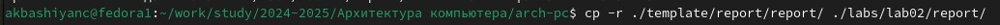
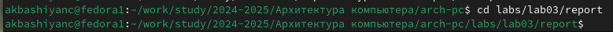
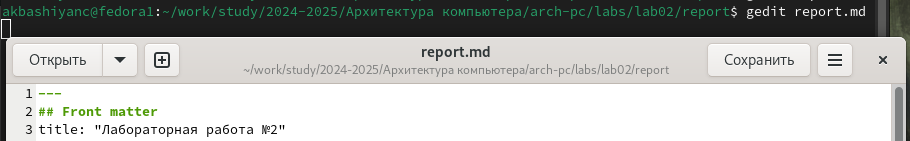
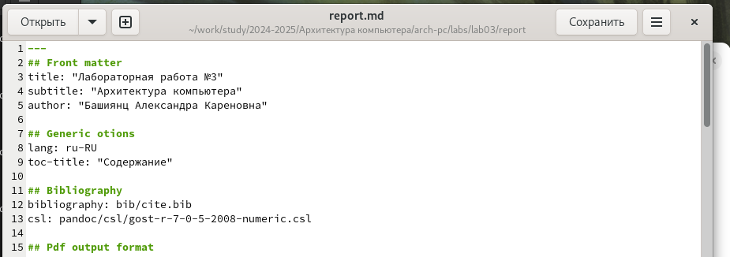
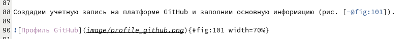
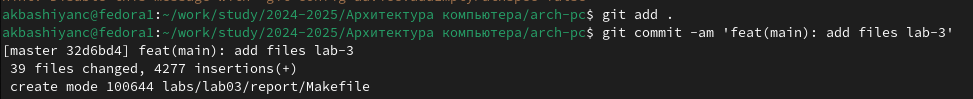
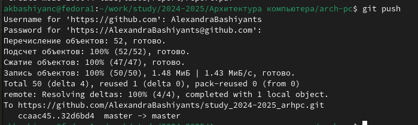

---
## Front matter
title: "Лабораторная работа №3"
subtitle: "Архитектура компьютера"
author: "Башиянц Александра Кареновна"

## Generic otions
lang: ru-RU
toc-title: "Содержание"

## Bibliography
bibliography: bib/cite.bib
csl: pandoc/csl/gost-r-7-0-5-2008-numeric.csl

## Pdf output format
toc: true # Table of contents
toc-depth: 2
fontsize: 12pt
linestretch: 1.5
papersize: a4
documentclass: scrreprt
## I18n polyglossia
polyglossia-lang:
  name: russian
  options:
	- spelling=modern
	- babelshorthands=true
polyglossia-otherlangs:
  name: english
## I18n babel
babel-lang: russian
babel-otherlangs: english
## Fonts
mainfont: IBM Plex Serif
romanfont: IBM Plex Serif
sansfont: IBM Plex Sans
monofont: IBM Plex Mono
mathfont: STIX Two Math
mainfontoptions: Ligatures=Common,Ligatures=TeX,Scale=0.94
romanfontoptions: Ligatures=Common,Ligatures=TeX,Scale=0.94
sansfontoptions: Ligatures=Common,Ligatures=TeX,Scale=MatchLowercase,Scale=0.94
monofontoptions: Scale=MatchLowercase,Scale=0.94,FakeStretch=0.9
mathfontoptions:
## Biblatex
biblatex: true
biblio-style: "gost-numeric"
biblatexoptions:
  - parentracker=true
  - backend=biber
  - hyperref=auto
  - language=auto
  - autolang=other*
  - citestyle=gost-numeric
## Pandoc-crossref LaTeX customization
figureTitle: "Рис."
tableTitle: "Таблица"

## Misc options
indent: true
header-includes:
  - \usepackage{indentfirst}
  - \usepackage{float} # keep figures where there are in the text
  - \floatplacement{figure}{H} # keep figures where there are in the text
---

# Цель работы

Цель работы --- изучить процедуры оформления отчетов с помощью легковесного
языка разметки Markdown.

# Задание

В этой лабораторной работе необходимо изучить и освоить процедуру оформления отчетов с помощью Markdown.
Необходимо научиться:
* Создавать docx и pdf-файлы
* Создавать ссылки на изображения
* Оформлять текст
Выполняя это задание, мы получим практический опыт работы с Markdown.

# Выполнение лабораторной работы

Скопируем шаблон отчета в директорию lab02 (рис. [-@fig:101]).

{#fig:101 width=70%}

Перейдем в каталог report (рис. [-@fig:102]) и откроем файл report.md с помощью gedit (рис. [-@fig:103).

{#fig:102 width=70%}

{#fig:103 width=70%}

Заполним отчет (рис. [-@fig:202]).

{#fig:202 width=70%}

Для того, чтобы сделать ссылку на изображение необходимо использовать [-@fig:название_изображения] (рис. [-@fig:203]).

{#fig:203 width=70%}

Сохраним изменения, загрузив файлы на GitHub (рис. [-@fig:204] и рис. [-@fig:205]).

{#fig:204 width=70%}

{#fig:205 width=70%}

# Выводы

В ходе выполнения работы были получены навыки практической работы с системой git.

