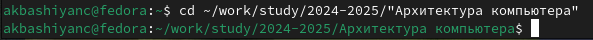

---
## Front matter
title: "Лабораторная работа №3"
subtitle: "Архитектура компьютера"
author: "Башиянц Александра Кареновна"

## Generic otions
lang: ru-RU
toc-title: "Содержание"

## Bibliography
bibliography: bib/cite.bib
csl: pandoc/csl/gost-r-7-0-5-2008-numeric.csl

## Pdf output format
toc: true # Table of contents
toc-depth: 2

fontsize: 12pt
linestretch: 1.5
papersize: a4
documentclass: scrreprt
## I18n polyglossia
polyglossia-lang:
  name: russian
  options:
	- spelling=modern
	- babelshorthands=true
polyglossia-otherlangs:
  name: english
## I18n babel
babel-lang: russian
babel-otherlangs: english
## Fonts
mainfont: IBM Plex Serif
romanfont: IBM Plex Serif
sansfont: IBM Plex Sans
monofont: IBM Plex Mono
mathfont: STIX Two Math
mainfontoptions: Ligatures=Common,Ligatures=TeX,Scale=0.94
romanfontoptions: Ligatures=Common,Ligatures=TeX,Scale=0.94
sansfontoptions: Ligatures=Common,Ligatures=TeX,Scale=MatchLowercase,Scale=0.94
monofontoptions: Scale=MatchLowercase,Scale=0.94,FakeStretch=0.9
mathfontoptions:
## Biblatex
biblatex: true
biblio-style: "gost-numeric"
biblatexoptions:
  - parentracker=true
  - backend=biber
  - hyperref=auto
  - language=auto
  - autolang=other*
  - citestyle=gost-numeric
## Pandoc-crossref LaTeX customization
figureTitle: "Рис."
tableTitle: "Таблица"

## Misc options
indent: true
header-includes:
  - \usepackage{indentfirst}
  - \usepackage{float} # keep figures where there are in the text
  - \floatplacement{figure}{H} # keep figures where there are in the text
---

# Цель работы

Цель работы --- изучение идеологии и применение средств контроля версий. А также получение практических навыков по работе с системой git.

# Задание

В этой лабораторной работе необходимо изучить и освоить основные команды для работы git.
Необходимо научиться:
* Настраивать git
* Создавать SSH ключи
* Создавать рабочие пространства и репозитории
* Настраивать каталоги
Выполняя это задание, мы получим практический опыт работы с git и GitHub.

# Выполнение лабораторной работы

## Настройка GitHub

Создадим учетную запись на платформе GitHub и заполним основную информацию (рис. [-@fig:101]).

{#fig:101 width=70%}

## Базовая настройка git

Сделаем предварительную конфигурацию git. Откроем терминал и введем
команды, указав имя и email владельца репозитория (рис. [-@fig:201]).

{#fig:201 width=70%}

Настроим utf-8 в выводе сообщений git (рис. [-@fig:202]).

{#fig:202 width=70%}

Зададим имя начальной ветки (будем называть её master) (рис. [-@fig:203]).

{#fig:203 width=70%}

Зададим параметр autocrlf (рис. [-@fig:204]).

{#fig:204 width=70%}

Зададим  параметр safecrlf (рис. [-@fig:205]).

{#fig:205 width=70%}

## Создание SSH ключа

Для последующей идентификации пользователя на сервере репозиториев необходимо сгенерировать пару ключей (приватный и открытый) (рис. [-@fig:301]).

{#fig:301 width=70%}

Далее необходимо загрузить сгенеренный открытый ключ. Для этого зайдем на сайт http://github.org/ под своей учётной записью и перейдем в меню Setting. После этого выберем в боковом меню SSH and GPG keys и нажать кнопку New SSH key. Скопировав из локальной консоли ключ в буфер обмена (рис. [-@fig:302)].

{#fig:302 width=70%}
 

Вставляем ключ в появившееся на сайте поле и указываем для ключа имя (Title) (рис. [-@fig:303]).

{#fig:303 width=70%}

## Сознание рабочего пространства и репозитория курса на основе шаблона

Откроем терминал и создайте каталог для предмета «Архитектура компьютера» (рис. [-@fig:401]).

{#fig:401 width=70%}

## Сознание репозитория курса на основе шаблона

Репозиторий на основе шаблона можно создать через web-интерфейс github. Перейдем на станицу репозитория с шаблоном курса https://github.com/yamadharma/course-directory-student-template. Далее выберем Use this template (рис. [-@fig:501]).

{#fig:501 width=70%}

В открывшемся окне зададим имя репозитория (Repository name) study_2024–2025_arhpc и создадим репозиторий (кнопка Create repository from template) (рис. [-@fig:502]).

{#fig:502 width=70%}
 

Откроем терминал и перейдите в каталог курса (рис. [-@fig:503]).

{#fig:503 width=70%}
 

Клонируем каталог курса (рис. [-@fig:504]).

{#fig:504 width=70%}

## Настройка каталога курса
Удалим лишние файлы (рис. [-@fig:601]).

{#fig:601 width=70%}

Создадим необходимые каталоги (рис. [-@fig:602]).

{#fig:602 width=70%}
 

Отправим файлы на сервер (рис. [-@fig:603]).

{#fig:603 width=70%}
 

Для подтверждения команды push необходимо в поле пароля ввести Personal access tokens, который нужно создать в настройках разработчика (рис. [-@fig:604]).

{#fig:604 width=70}
 

Проверим правильность создания иерархии рабочего пространства в локальном репозитории (рис. [-@fig:605]) и на странице github (рис. [-@fig:606]).

{#fig:605 width=70%}

{#fig:606 width=70%}

## Задание для самостоятельной работы
Создадим каталоги lab01 и lab02 для дальнейшей загрузки отчетов по лабораторным работам в эти директории (рис. [-@fig:701]).

{#fig:701 width=70%}
 
Перенесем отчеты по Лабораторной работе №1 и №2 в соответствующие категории (рис. [-@fig:702] и рис. [-@fig:703]).

{#fig:702 width=70%}

{#fig:703 width=70%}
 
Загрузим файлы на GitHub (рис. [-@fig:704]).

{#fig:704 width=70%}

# Выводы

В ходе выполнения работы были получены навыки практической работы с системой git.

