---
## Front matter
title: "Лабораторная работа №4"
subtitle: "Архитектура компьютера"
author: "Башиянц Александра Кареновна"

## Generic otions
lang: ru-RU
toc-title: "Содержание"

## Bibliography
bibliography: bib/cite.bib
csl: pandoc/csl/gost-r-7-0-5-2008-numeric.csl

## Pdf output format
toc: true # Table of contents
toc-depth: 2
fontsize: 12pt
linestretch: 1.5
papersize: a4
documentclass: scrreprt
## I18n polyglossia
polyglossia-lang:
  name: russian
  options:
	- spelling=modern
	- babelshorthands=true
polyglossia-otherlangs:
  name: english
## I18n babel
babel-lang: russian
babel-otherlangs: english
## Fonts
mainfont: IBM Plex Serif
romanfont: IBM Plex Serif
sansfont: IBM Plex Sans
monofont: IBM Plex Mono
mathfont: STIX Two Math
mainfontoptions: Ligatures=Common,Ligatures=TeX,Scale=0.94
romanfontoptions: Ligatures=Common,Ligatures=TeX,Scale=0.94
sansfontoptions: Ligatures=Common,Ligatures=TeX,Scale=MatchLowercase,Scale=0.94
monofontoptions: Scale=MatchLowercase,Scale=0.94,FakeStretch=0.9
mathfontoptions:
## Biblatex
biblatex: true
biblio-style: "gost-numeric"
biblatexoptions:
  - parentracker=true
  - backend=biber
  - hyperref=auto
  - language=auto
  - autolang=other*
  - citestyle=gost-numeric
## Pandoc-crossref LaTeX customization
figureTitle: "Рис."
tableTitle: "Таблица"

## Misc options
indent: true
header-includes:
  - \usepackage{indentfirst}
  - \usepackage{float} # keep figures where there are in the text
  - \floatplacement{figure}{H} # keep figures where there are in the text
---

# Цель работы

Цель работы --- освоить процедуры компиляции и сборки программ, написанных на ассемблере NASM.

# Задание

В этой лабораторной работе необходимо изучить и освоить процедуры компиляции и сборки программ, написанных на ассемблере NASM.

Необходимо научиться:

* Создавать файл .asm

* Компилировать код

* Компоновать объектный файл

* Запускать файл

Выполняя это задание, мы получим практический опыт работы с NASM.

# Выполнение лабораторной работы

## Программа Hello world!

Перейдем в директорию lab04 (рис. [-@fig:cd]).

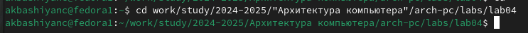{#fig:cd width=70%}

Создадим файл hello.asm (рис. [-@fig:touch]).

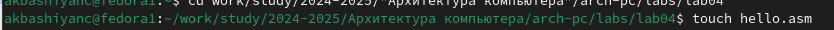{#fig:touch width=70%}

Откроем файл hello.asm и введем код (рис. [-@fig:edit_hello]).

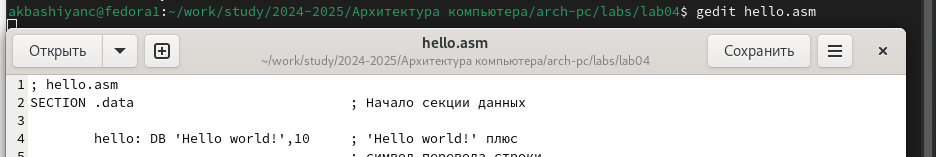{#fig:edit_hello width=70%}

## Транслятор NASM

Транслятор преобразует текст программы из файла hello.asm в объектный код, который запишется в файл hello.o (рис. [-@fig:nasm]).

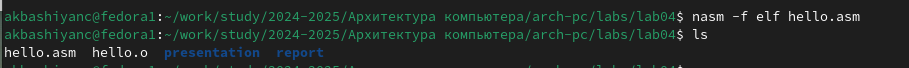{#fig:nasm width=70%}

## Расширенный синтаксис командной строки NASM

Скомпилируем исходный файл hello.asm в obj.o (рис. [-@fig:obj]).

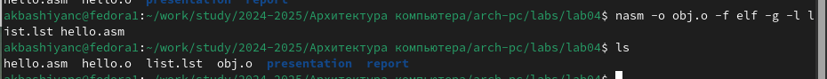{#fig:obj width=70%}

## Компоновщик LD

Получим исполняемую программу, для этого объектный файл передадим на обработку компоновщику (рис. [-@fig:ld]).

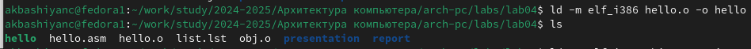{#fig:ld width=70%}

Проверим ключ -o (рис. [-@fig:ld_o]).

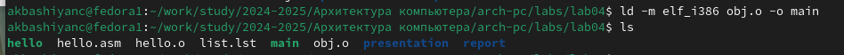{#fig:ld_o width=70%}

## Запуск исполняемого файла

Запустим файл hello (рис. [-@fig:ld_o]).

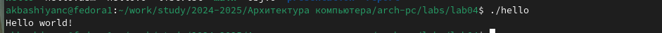{#fig:hello width=70%}

## Задание для самостоятельной работы

Создадим копию файла hello (рис. [-@fig:cp]).

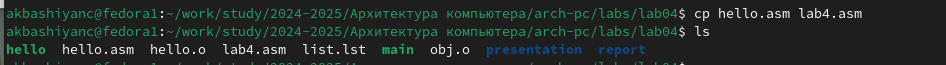{#fig:cp width=70%}

Исправим файл lab4.asm, вставим Фаимилию и имя (рис. [-@fig:edit_lab4]).

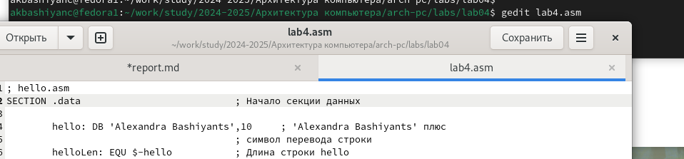{#fig:edit_lab4 width=70%}

Оттранслируем полученный текст программы lab4.asm в объектный файл. Выполним
компоновку объектного файла и запустим получившийся исполняемый файл (рис. [-@fig:final]).

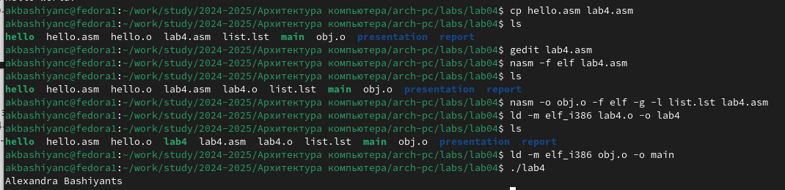{#fig:final width=70%}

Загрузим файлы на GitHub (рис. [-@fig:git]).

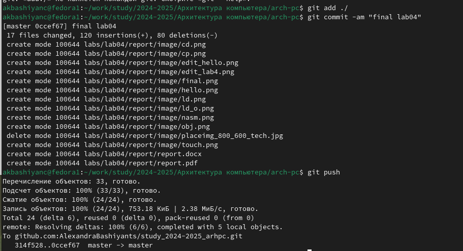{#fig:git width=70%}

# Выводы

В ходе выполнения работы были получены навыки практической работы с ассемблером NASM.

