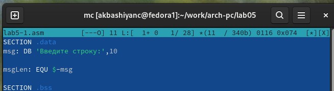

---
## Front matter
title: "Лабораторная работа №5"
subtitle: "Архитектура компьютера"
author: "Башиянц Александра Кареновна"

## Generic otions
lang: ru-RU
toc-title: "Содержание"

## Bibliography
bibliography: bib/cite.bib
csl: pandoc/csl/gost-r-7-0-5-2008-numeric.csl

## Pdf output format
toc: true # Table of contents
toc-depth: 2
fontsize: 12pt
linestretch: 1.5
papersize: a4
documentclass: scrreprt
## I18n polyglossia
polyglossia-lang:
  name: russian
  options:
	- spelling=modern
	- babelshorthands=true
polyglossia-otherlangs:
  name: english
## I18n babel
babel-lang: russian
babel-otherlangs: english
## Fonts
mainfont: IBM Plex Serif
romanfont: IBM Plex Serif
sansfont: IBM Plex Sans
monofont: IBM Plex Mono
mathfont: STIX Two Math
mainfontoptions: Ligatures=Common,Ligatures=TeX,Scale=0.94
romanfontoptions: Ligatures=Common,Ligatures=TeX,Scale=0.94
sansfontoptions: Ligatures=Common,Ligatures=TeX,Scale=MatchLowercase,Scale=0.94
monofontoptions: Scale=MatchLowercase,Scale=0.94,FakeStretch=0.9
mathfontoptions:
## Biblatex
biblatex: true
biblio-style: "gost-numeric"
biblatexoptions:
  - parentracker=true
  - backend=biber
  - hyperref=auto
  - language=auto
  - autolang=other*
  - citestyle=gost-numeric
## Pandoc-crossref LaTeX customization
figureTitle: "Рис."
tableTitle: "Таблица"

## Misc options
indent: true
header-includes:
  - \usepackage{indentfirst}
  - \usepackage{float} # keep figures where there are in the text
  - \floatplacement{figure}{H} # keep figures where there are in the text
---

# Цель работы

Цель работы --- приобрести практических навыков работы в Midnight Commander. Освоение инструкций
языка ассемблера mov и int.

# Задание

В этой лабораторной работе необходимо изучить работу в Midnight Commander и освоить инструкции
языка ассемблера mov и int.

Необходимо научиться:

* Заходить в Midnight Commander

* Копировать, перемещать, просматривать и режактировать файлы из Midnight Commander

* Дублирования данных источника в приемнике

* Записывать в переменную введенные данные

* Вызывать прерывания с указанным номером

Выполняя это задание, мы получим практический опыт работы с Midnight Commander и NASM.

# Выполнение лабораторной работы

Откроем mc (рис. [-@fig:1_mc]).

{#fig:1_mc width=70%}

Создадим директорию -- с помощью F7 (рис. [-@fig:2_mkdir]).

{#fig:2_mkdir width=70%}

Создадим файл lab5-1.asm (рис. [-@fig:3_touch]).

{#fig:3_touch width=70%}

Проверим наличие файла lab5-1.asm в директории (рис. [-@fig:3_1_ls]).

{#fig:3_1_ls width=70%}

Введем код в файл, открыв редактор с помощью F4 (рис. [-@fig:4_edit]).

{#fig:4_edit width=70%}

Проверим файл, открыв с помощью F3 (рис. [-@fig:4_1_look]).

{#fig:4_1_look width=70%}

Оттранслируем текст программы lab5-1.asm в объектный файл. Выполним компоновку объектного файла и запустим получившийся исполняемый файл (рис. [-@fig:5_work]).

{#fig:5_work width=70%}

Скачаем файл in_out.asm и скопируем его в рабочую директорию (рис. [-@fig:6_cp_inout]).

{#fig:6_cp_inout width=70%}

Скопируем файл lab5-1.asm и сохраним под названием lab5-2.asm (рис. [-@fig:7_cp_1]).

{#fig:7_cp_1 width=70%}

Отредактируем файл lab5-2.asm, используя подпрограммы из внешнего файла in_out.asm (рис. [-@fig:8_edit2]).

{#fig:8_edit2 width=70%}

Оттранслируем текст программы lab5-2.asm в объектный файл. Выполним компоновку объектного файла и запустим получившийся исполняемый файл (рис. [-@fig:9_work2]).

{#fig:9_work2 width=70%}

Проверим, что будет при изменении sprintLF на sprint (рис. [-@fig:10_exp] и [-@fig:10_exp_work]).

{#fig:10_exp width=70%}

{#fig:10_exp_work width=70%}

Заметим, что при sprintLF ФИО пишется в следующей строке, а при sprint в той же строке, что и "Введите строку".

## Задание для самостоятельной работы

Создадим копию файла lab5-1.asm (рис. [-@fig:11_0_cp1-3]).

{#fig:11_0_cp1-3 width=70%}

Исправим файл lab5-3.asm так, чтобы выводилось значение, которое было введено ранее (рис. [-@fig:11_edit3]).

{#fig:11_edit3 width=70%}

Оттранслируем текст программы lab5-3.asm в объектный файл. Выполним компоновку объектного файла и запустим получившийся исполняемый файл (рис. [-@fig:12_work3]).

{#fig:12_work3 width=70%}

Исправим обратно sprint на sprintLF. Создадим копию файла lab5-2.asm (рис. [-@fig:13_cp2]).

{#fig:13_cp2 width=70%}

Исправим файл lab5-4.asm так, чтобы выводилось значение, которое было введено ранее (рис. [-@fig:14_edit4]).

{#fig:14_edit4 width=70%}

Оттранслируем текст программы lab5-4.asm в объектный файл. Выполним компоновку объектного файла и запустим получившийся исполняемый файл (рис. [-@fig:15_work4]).

{#fig:15_work4 width=70%}

# Выводы

В ходе выполнения работы были получены навыки практической работы с ассемблером NASM и Midnight Commander.

