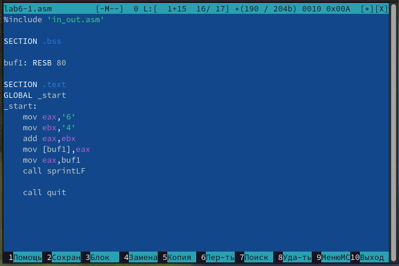
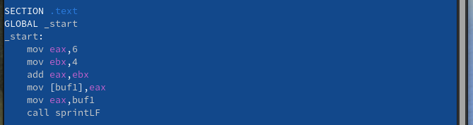
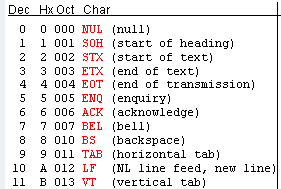
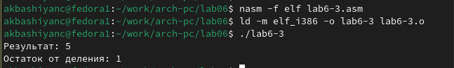

---
## Front matter
title: "Лабораторная работа №6"
subtitle: "Архитектура компьютера"
author: "Башиянц Александра Кареновна"

## Generic otions
lang: ru-RU
toc-title: "Содержание"

## Bibliography
bibliography: bib/cite.bib
csl: pandoc/csl/gost-r-7-0-5-2008-numeric.csl

## Pdf output format
toc: true # Table of contents
toc-depth: 2
fontsize: 12pt
linestretch: 1.5
papersize: a4
documentclass: scrreprt
## I18n polyglossia
polyglossia-lang:
  name: russian
  options:
	- spelling=modern
	- babelshorthands=true
polyglossia-otherlangs:
  name: english
## I18n babel
babel-lang: russian
babel-otherlangs: english
## Fonts
mainfont: IBM Plex Serif
romanfont: IBM Plex Serif
sansfont: IBM Plex Sans
monofont: IBM Plex Mono
mathfont: STIX Two Math
mainfontoptions: Ligatures=Common,Ligatures=TeX,Scale=0.94
romanfontoptions: Ligatures=Common,Ligatures=TeX,Scale=0.94
sansfontoptions: Ligatures=Common,Ligatures=TeX,Scale=MatchLowercase,Scale=0.94
monofontoptions: Scale=MatchLowercase,Scale=0.94,FakeStretch=0.9
mathfontoptions:
## Biblatex
biblatex: true
biblio-style: "gost-numeric"
biblatexoptions:
  - parentracker=true
  - backend=biber
  - hyperref=auto
  - language=auto
  - autolang=other*
  - citestyle=gost-numeric
## Pandoc-crossref LaTeX customization
figureTitle: "Рис."
tableTitle: "Таблица"

## Misc options
indent: true
header-includes:
  - \usepackage{indentfirst}
  - \usepackage{float} # keep figures where there are in the text
  - \floatplacement{figure}{H} # keep figures where there are in the text
---

# Цель работы

Цель работы --- освоить арифметических инструкций языка ассемблера NASM.

# Задание

В этой лабораторной работе необходимо изучить работу арифметических функций в NASM.

Необходимо научиться:

* Складывать 2 числа;

* Умножать 2 числа;

* Делить 2 числа;

* Находить целую часть деления и остаток от него;

* Вызывать прерывания с указанным номером.

Выполняя это задание, мы получим практический опыт работы с арифметическими командами NASM.

# Выполнение лабораторной работы

Создадим директорию для 6 лабораторной работы и создадим файл lab6-1.asm (рис. [-@fig:1_mkdir]).

{#fig:1_mkdir width=70%}

Скопируем файл in_out.asm из lab05 с помощью mc (рис. [-@fig:2_cp]).

{#fig:2_cp width=70%}

Введем код в lab6-1.asm (рис. [-@fig:3_edit_1]).

{#fig:3_edit_1 width=70%}

Создадим исполняемый файл и запустим его (рис. [-@fig:4_work1]).

{#fig:4_work1 width=70%}

Изменим текст программы и вместо символов, запишем в регистры числа (рис. [-@fig:5_edit1_2]).

{#fig:5_edit1_2 width=70%}

Запустим измененный файл (рис. [-@fig:6_work1_2]).

{#fig:6_work1_2 width=70%}

Проверим по таблице ASCII, что вывелось (рис. [-@fig:7_ascii]).

{#fig:7_ascii width=70%}

Создадим файл lab6-2.asm (рис. [-@fig:8_touch2]).

{#fig:8_touch2 width=70%}

Введем код в lab6-2.asm (рис. [-@fig:9_edit_2]).

{#fig:9_edit_2 width=70%}

Создадим исполняемый файл и запустим его (рис. [-@fig:10_work2]).

{#fig:10_work2 width=70%}

Изменим текст программы и вместо символов, запишем в регистры числа (рис. [-@fig:11_edit2_2]).

{#fig:11_edit2_2 width=70%}

Запустим измененный файл (рис. [-@fig:12_work2_2]).

{#fig:12_work2_2 width=70%}

Заметим, что теперь программа выполняется корректно.

Изменим текст программы и вместо iprintLF напишем iprint (рис. [-@fig:13_edit2_1]).

{#fig:13_edit2_1 width=70%}

Запустим измененный файл (рис. [-@fig:13.0_work2_2]).

{#fig:13.0_work2_2 width=70%}

Заметим, что при изменении iprintLF на iprint вывод программы не изменился.

Создадим файл lab6-3.asm (рис. [-@fig:14_0_touch3]).

{#fig:14_0_touch3 width=70%}

Вычислим арифметическое выражения f(x)=(5*2+3)/3. Введем код в lab6-3.asm (рис. [-@fig:13_edit3]).

{#fig:13_edit3 width=70%}

Создадим исполняемый файл и запустим его (рис. [-@fig:14_work3]).

{#fig:14_work3 width=70%}

Изменим текст программы так, чтобы мы вычислили f(x)=(4*6+2)/5 (рис. [-@fig:15_edit3_2]).

{#fig:15_edit3_2 width=70%}

Запустим измененный файл (рис. [-@fig:16_work3_2]).

{#fig:16_work3_2 width=70%}

Создадим файл variant.asm (рис. [-@fig:17_touch_var]).

{#fig:17_touch_var width=70%}

Введем код в variant.asm (рис. [-@fig:18_edit_var]).

{#fig:18_edit_var width=70%}

Создадим исполняемый файл и запустим его (рис. [-@fig:19_work_var]).

{#fig:19_work_var width=70%}

Проверим правильность выполнения программы с помощью калькулятора (рис. [-@fig:20_var_check]).

{#fig:20_var_check width=70%}

## Ответы на вопросы

1. Строки "mov eax,rem ; call sprint" отвечают за вывод на экран сообщения ‘Ваш вариант:’.

2. Эта инструкция используется для получения данных из переменной x.

3. call atoi используется для превращение ASCII кода в число.

4. За вычисления варианта отвечают строки:

xor edx,edx

mov ebx,20

div ebx

inc edx

5. Остаток от деления при выполнении инструкции "div ebx" записывается в регистр eax.

6. Для чего используется Инструкция “inc edx” используется для увеличение операнда на 1.

## Задание для самостоятельной работы

Создадим файл func.asm (рис. [-@fig:21_touch_f]).

{#fig:21_touch_f width=70%}

Введем код для подсчета функции f(x)=3(x+10)-20(вариант 18) в func.asm (рис. [-@fig:22_edit_f]).

{#fig:22_edit_f width=70%}

Создадим исполняемый файл и запустим его (рис. [-@fig:23_work_f]).

{#fig:23_work_f width=70%}

Проверим правильность выполнения программы с помощью калькулятора (рис. [-@fig:24_check_func]).

{#fig:24_check_func width=70%}

# Выводы

В ходе выполнения работы были получены навыки практической работы с арифметическими функциями в NASM.

