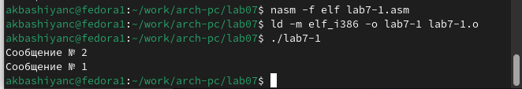
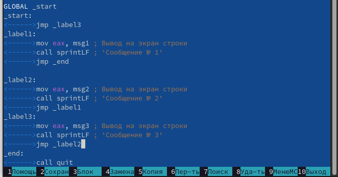

---
## Front matter
title: "Лабораторная работа №7"
subtitle: "Архитектура компьютера"
author: "Башиянц Александра Кареновна"

## Generic otions
lang: ru-RU
toc-title: "Содержание"

## Bibliography
bibliography: bib/cite.bib
csl: pandoc/csl/gost-r-7-0-5-2008-numeric.csl

## Pdf output format
toc: true # Table of contents
toc-depth: 2
fontsize: 12pt
linestretch: 1.5
papersize: a4
documentclass: scrreprt
## I18n polyglossia
polyglossia-lang:
  name: russian
  options:
	- spelling=modern
	- babelshorthands=true
polyglossia-otherlangs:
  name: english
## I18n babel
babel-lang: russian
babel-otherlangs: english
## Fonts
mainfont: IBM Plex Serif
romanfont: IBM Plex Serif
sansfont: IBM Plex Sans
monofont: IBM Plex Mono
mathfont: STIX Two Math
mainfontoptions: Ligatures=Common,Ligatures=TeX,Scale=0.94
romanfontoptions: Ligatures=Common,Ligatures=TeX,Scale=0.94
sansfontoptions: Ligatures=Common,Ligatures=TeX,Scale=MatchLowercase,Scale=0.94
monofontoptions: Scale=MatchLowercase,Scale=0.94,FakeStretch=0.9
mathfontoptions:
## Biblatex
biblatex: true
biblio-style: "gost-numeric"
biblatexoptions:
  - parentracker=true
  - backend=biber
  - hyperref=auto
  - language=auto
  - autolang=other*
  - citestyle=gost-numeric
## Pandoc-crossref LaTeX customization
figureTitle: "Рис."
tableTitle: "Таблица"

## Misc options
indent: true
header-includes:
  - \usepackage{indentfirst}
  - \usepackage{float} # keep figures where there are in the text
  - \floatplacement{figure}{H} # keep figures where there are in the text
---

# Цель работы

Цель работы --- изучить команды условного и безусловного переходов.

# Задание

В этой лабораторной работе необходимо изучить работу условного и безусловного переходов в NASM.

Необходимо научиться:

* Изучить команды условного и безусловного переходов;

* Приобрести навыки написания программ с использованием переходов;

* Узнать назначение и структуру файла листинга.

Выполняя это задание, мы получим практический опыт работы условного и безусловного переходов в NASM.

# Выполнение лабораторной работы

## Реализация переходов в NASM

Создадим директорию для 7 лабораторной работы и создадим файл lab7-1.asm (рис. [-@fig:1_mkdir]).

{#fig:1_mkdir width=70%}

Скопируем файл in_out.asm из lab06 с помощью mc (рис. [-@fig:2_cp_inout]).

{#fig:2_cp_inout width=70%}

Введем код в lab7-1.asm и создадим исполняемый файл и запустим его (рис. [-@fig:3_make1]).

{#fig:3_make1 width=70%}

Изменим код так, чтобы она выводила сначала 'Сообщение № 2', потом 'Сообщение№ 1' и завершала работу (рис. [-@fig:4_edit1]).

{#fig:4_edit1 width=70%}

Создадим исполняемый файл и запустим его (рис. [-@fig:5_work1_1]).

{#fig:5_work1_1 width=70%}

Изменим код так, чтобы она выводила сначала 'Сообщение № 3', потом 'Сообщение № 2' и 'Сообщение№ 1' и завершала работу (рис. [-@fig:6_edit1_2]).

{#fig:6_edit1_2 width=70%}

Создадим исполняемый файл и запустим его (рис. [-@fig:7_work1_2]).

{#fig:7_work1_2 width=70%}

Создадим файл lab7-1.asm (рис. [-@fig:8_touch2]).

{#fig:8_touch2 width=70%}

Введем код в lab7-1.asm (рис. [-@fig:9_code]).

{#fig:9_code width=70%}

Создадим исполняемый файл и запустим его (рис. [-@fig:10_work2]).

{#fig:10_work2 width=70%}

## Изучение структуры файлы листинга

Выполним команду nasm с ключом -l (рис. [-@fig:11_lst]).

{#fig:11_lst width=70%}

Откроем созданный файл (рис. [-@fig:12_lst_check]).

{#fig:12_lst_check width=70%}

Удалим в файле .asm одну строчку и посмтрим разницу медлу первым и вторым файлом .lst (рис. [-@fig:13_del_line], [-@fig:14_lst_check2], [-@fig:15_cpm])

{#fig:13_del_line width=70%}

{#fig:14_lst_check2 width=70%}

{#fig:15_cpm width=70%}

Рассмотрим 3 строки:
1.     16 0000000E C3                  <1>     ret

2.     23 0000000F 52                  <1>     push    edx

3.    118 00000094 E876FFFFFF          <1>     call    sprint

* 16, 23, 118 - номера строк файла листинга

* 0000000E, 0000000F, 00000094 - смещение машинного кода от начала текущего сегмента

* C3, 52, E876FFFFFF - ассемблированная исходна строка в виде шестнадцатеричной последовательности

* ret, push edx, call sprint - исходный текст программы

* ret - команда "return".  Эта команда используется для возврата из подпрограммы или функции обратно в вызывающий код

* push edx - перемыещение содержимого регистра edx на вершину стека

* call sprint - вызов функции печати сообщения.

## Задание для самостоятельной работы

### Задание 1

Создадим файл ex1.asm (рис. [-@fig:16_0_touch_ex1]).

{#fig:16_0_touch_ex1 width=70%}

Введем код для нахождения минимального значения в ex1.asm (рис. [-@fig:16_code_ex1]).

{#fig:16_code_ex1 width=70%}

Создадим исполняемый файл и запустим его, подставив для проверки значения 83,73,30 (вариант 18) (рис. [-@fig:17_make_ex1]).

{#fig:17_make_ex1 width=70%}

### Задание 2

Создадим файл ex2.asm (рис. [-@fig:18_touch_ex2]).

{#fig:18_touch_ex2 width=70%}

Введем код для нахождения функции f(x) (вариант 18) в ex2.asm (рис. [-@fig:19_code_ex2]).

{#fig:19_code_ex2 width=70%}

Создадим исполняемый файл и запустим его, подставив для проверки значения (1,2) и (2,1) (вариант 18) (рис. [-@fig:20_workex2]).

{#fig:20_workex2 width=70%}

# Выводы

В ходе выполнения работы были получены навыки практической работы с работой условного и безусловного переходов в NASM.

