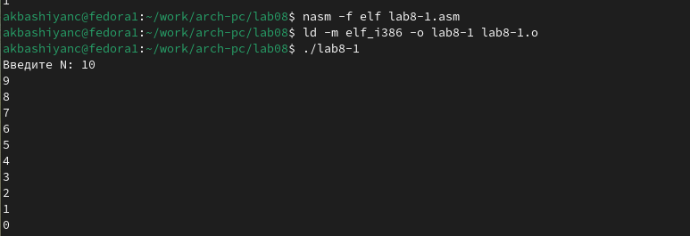

---
## Front matter
title: "Лабораторная работа №8"
subtitle: "Архитектура компьютера"
author: "Башиянц Александра Кареновна"

## Generic otions
lang: ru-RU
toc-title: "Содержание"

## Bibliography
bibliography: bib/cite.bib
csl: pandoc/csl/gost-r-7-0-5-2008-numeric.csl

## Pdf output format
toc: true # Table of contents
toc-depth: 2
fontsize: 12pt
linestretch: 1.5
papersize: a4
documentclass: scrreprt
## I18n polyglossia
polyglossia-lang:
  name: russian
  options:
	- spelling=modern
	- babelshorthands=true
polyglossia-otherlangs:
  name: english
## I18n babel
babel-lang: russian
babel-otherlangs: english
## Fonts
mainfont: IBM Plex Serif
romanfont: IBM Plex Serif
sansfont: IBM Plex Sans
monofont: IBM Plex Mono
mathfont: STIX Two Math
mainfontoptions: Ligatures=Common,Ligatures=TeX,Scale=0.94
romanfontoptions: Ligatures=Common,Ligatures=TeX,Scale=0.94
sansfontoptions: Ligatures=Common,Ligatures=TeX,Scale=MatchLowercase,Scale=0.94
monofontoptions: Scale=MatchLowercase,Scale=0.94,FakeStretch=0.9
mathfontoptions:
## Biblatex
biblatex: true
biblio-style: "gost-numeric"
biblatexoptions:
  - parentracker=true
  - backend=biber
  - hyperref=auto
  - language=auto
  - autolang=other*
  - citestyle=gost-numeric
## Pandoc-crossref LaTeX customization
figureTitle: "Рис."
tableTitle: "Таблица"

## Misc options
indent: true
header-includes:
  - \usepackage{indentfirst}
  - \usepackage{float} # keep figures where there are in the text
  - \floatplacement{figure}{H} # keep figures where there are in the text
---

# Цель работы

Цель работы --- приобретести навыки написания программ с использованием циклов и обработкой
аргументов командной строки.

# Задание

В этой лабораторной работе необходимо изучить работу циклов и обратку аргументов командной строки.

Необходимо научиться:

* Изучить команды циклов;

* Приобрести навыки циклов;

* Узнать назначение циклов;

* Изучить команды использования аргументов командной строки.

Выполняя это задание, мы получим практический опыт работы циклов и получения аргументов из командной строки.

# Выполнение лабораторной работы

## Реализация циклов в NASM

Создадим директорию для 8 лабораторной работы и создадим файл lab8-1.asm (рис. [-@fig:1_mkdir]).

{#fig:1_mkdir width=70%}

Скопируем файл in_out.asm из lab06 с помощью mc (рис. [-@fig:2_cp_inout]).

{#fig:2_cp_inout width=70%}

Введем код в lab7-1.asm и создадим исполняемый файл и запустим его (рис. [-@fig:3_code1] и [-@fig:4_work1]).

{#fig:3_code1 width=70%}

{#fig:4_work1 width=70%}

Изменим код так, что использование регистра ecx в теле цилка loop может привести к некорректной работе программы (рис. [-@fig:5_edit_1]).

{#fig:5_edit_1 width=70%}

Создадим исполняемый файл и запустим его (рис. [-@fig:6_work1_1]).

{#fig:6_work1_1 width=70%}

Заметим, что теперь выводятся только нечетные числа, так как мы, добавив ecx в тело цилка loop, стали вычитать итератор 2 раза.

Изменим код, добавив команды push и pop (добавления в стек и извлечения из стека) для сохранения значения счетчика цикла loop (рис. [-@fig:7_edit_2]).

{#fig:7_edit_2 width=70%}

Создадим исполняемый файл и запустим его (рис. [-@fig:8_work1_2]).

{#fig:8_work1_2 width=70%}

Число проходов цикла соответствует знаечнию N, но в отличие от изначального кода, выводится числа от N-1 до 0.

## Обработка аргументов командной строки

Создадим файл lab8-2.asm (рис. [-@fig:9_touch2]).

{#fig:9_touch2 width=70%}

Введем код в lab8-2.asm (рис. [-@fig:10_code2]).

{#fig:10_code2 width=70%}

Создадим исполняемый файл и запустим его (рис. [-@fig:11_work2]). Было обработано все 3 аргумента.

{#fig:11_work2 width=70%}

Создадим файл lab8-3.asm (рис. [-@fig:12_touch3]).

{#fig:12_touch3 width=70%}

Введем код в lab8-2.asm (рис. [-@fig:13_code3]).

{#fig:13_code3 width=70%}

Создадим исполняемый файл и запустим его (рис. [-@fig:14_work3]). Было обработано все 3 аргумента.

{#fig:14_work3 width=70%}

Изменим код так, чтобы значения не складывались, а переменожались (рис. [-@fig:15_edit3_1]).

{#fig:15_edit3_1 width=70%}

Создадим исполняемый файл и запустим его (рис. [-@fig:16_work3_1]).

{#fig:16_work3_1 width=70%}

## Задание для самостоятельной работы

Создадим файл ex1.asm (рис. [-@fig:17_touch4]).

{#fig:17_touch4 width=70%}

Введем код для нахождения суммы функции f(x)=5*x+17 (вариант 18) в ex1.asm (рис. [-@fig:18_code4]).

{#fig:18_code4 width=70%}

Создадим исполняемый файл и запустим его (рис. [-@fig:19_work4]).

{#fig:19_work4 width=70%}

# Выводы

В ходе выполнения работы были получены навыки написания программ с использованием циклов и обработкой
аргументов командной строки.
