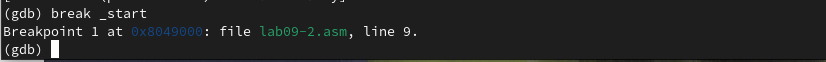

---
## Front matter
title: "Лабораторная работа №9"
subtitle: "Архитектура компьютера"
author: "Башиянц Александра Кареновна"

## Generic otions
lang: ru-RU
toc-title: "Содержание"

## Bibliography
bibliography: bib/cite.bib
csl: pandoc/csl/gost-r-7-0-5-2008-numeric.csl

## Pdf output format
toc: true # Table of contents
toc-depth: 2
fontsize: 12pt
linestretch: 1.5
papersize: a4
documentclass: scrreprt
## I18n polyglossia
polyglossia-lang:
  name: russian
  options:
	- spelling=modern
	- babelshorthands=true
polyglossia-otherlangs:
  name: english
## I18n babel
babel-lang: russian
babel-otherlangs: english
## Fonts
mainfont: IBM Plex Serif
romanfont: IBM Plex Serif
sansfont: IBM Plex Sans
monofont: IBM Plex Mono
mathfont: STIX Two Math
mainfontoptions: Ligatures=Common,Ligatures=TeX,Scale=0.94
romanfontoptions: Ligatures=Common,Ligatures=TeX,Scale=0.94
sansfontoptions: Ligatures=Common,Ligatures=TeX,Scale=MatchLowercase,Scale=0.94
monofontoptions: Scale=MatchLowercase,Scale=0.94,FakeStretch=0.9
mathfontoptions:
## Biblatex
biblatex: true
biblio-style: "gost-numeric"
biblatexoptions:
  - parentracker=true
  - backend=biber
  - hyperref=auto
  - language=auto
  - autolang=other*
  - citestyle=gost-numeric
## Pandoc-crossref LaTeX customization
figureTitle: "Рис."
tableTitle: "Таблица"

## Misc options
indent: true
header-includes:
  - \usepackage{indentfirst}
  - \usepackage{float} # keep figures where there are in the text
  - \floatplacement{figure}{H} # keep figures where there are in the text
---

# Цель работы

Цель работы --- приобретести навыки написания программ с использованием подпрограмм, познакомиться
с методами отладки при помощи GDB и его основными возможностями.

# Задание

В этой лабораторной работе необходимо изучить работу циклов и обратку аргументов командной строки.

Необходимо научиться:

* Изучить использование подпрограмм;

* Изучить создание точек останова;

* Узнать работу с данными программы в GDB;

* Изучить как обрабатывать аргументы командной строки в GDB

Выполняя это задание, мы получим практический опыт с работой подпрограмм и методами отладки при помощи GDB

# Выполнение лабораторной работы

## Реализация подпрограмм в NASM

Создадим директорию для 9 лабораторной работы и создадим файл lab09-1.asm (рис. [-@fig:1_mkdir]).

{#fig:1_mkdir width=70%}

Скопируем файл in_out.asm из lab06 с помощью mc (рис. [-@fig:2_cp_inout]).

{#fig:2_cp_inout width=70%}

Введем код в lab09-1.asm и создадим исполняемый файл и запустим его (рис. [-@fig:3_code1] и [-@fig:4_work1]).

{#fig:3_code1 width=70%}

{#fig:4_work1 width=70%}

## Отладка программам с помощью GDB

Создадим файл lab09-2.asm (рис. [-@fig:7_touch2]).

{#fig:7_touch2 width=70%}

Введем код в lab09-2.asm (рис. [-@fig:8_code2]).

{#fig:8_code2 width=70%}

Создадим исполняемый файл (рис. [-@fig:9_make2]). Для работы с GDB в исполняемый файл необходимо добавить отладочную информацию, для этого трансляцию программ необходимо проводить с ключом '-g'.

{#fig:9_make2 width=70%}

Загрузим исполняемый файл в отладчик gdb (рис. [-@fig:10_0_gdb1]).

{#fig:10_0_gdb1 width=70%}

Запустим файл (рис. [-@fig:10_run2]).

{#fig:10_run2 width=70%}

Для более подробного анализа программы установим брейкпоинт на метку _start, с которой начинается выполнение любой ассемблерной программы, и запустим её (рис. [-@fig:11_break]).

{#fig:11_break width=70%}

Посмотрим дисассимилированный код программы с помощью команды disassemble начиная с метки _start (рис. [-@fig:13_dis_start]).

{#fig:13_dis_start width=70%}

Переключимся на отображение команд с Intel’овским синтаксисом, введя команду set disassembly-flavor intel (рис. [-@fig:14_dis_set_run]).

{#fig:14_dis_set_run width=70%}

Включим режим псевдографики для более удобного анализа программы (рис. [-@fig:16_lay_regs]).

{#fig:16_lay_regs width=70%}

### Добавление точек останова

На предыдущих шагах была установлена точка останова по имени метки (_start). Проверим это с помощью команды info breakpoints (рис. [-@fig:17_info_br]).

{#fig:17_info_br width=70%}

Установим еще одну точку останова по адресу инструкции (рис. [-@fig:18_break_mov]).

{#fig:18_break_mov width=70%}

### Работа с данными программы в GDB

Посмотрим содержимое регистров также можно с помощью команды info registers (рис. [-@fig:19_info_reg]).

{#fig:19_info_reg width=70%}

Посмотрим значение переменной msg1 по имени (рис. [-@fig:20_msg1]).

{#fig:20_msg1 width=70%}

Посмотрим значение переменной msg2 по имени (рис. [-@fig:21_msg2]).

{#fig:21_msg2 width=70%}

Изменим значение для регистра или ячейки памяти можно с помощью команды set, задав ей в качестве аргумента имя регистра или адрес  (рис. [-@fig:22_edit_msg1]).

{#fig:22_edit_msg1 width=70%}

Изменим 1 символ в msg2 (рис. [-@fig:23_edit_msg2]).

{#fig:23_edit_msg2 width=70%}

С помощью команды set изменим значение регистра ebx (рис. [-@fig:24_edit_ebx]).

{#fig:24_edit_ebx width=70%}

Завершим выполнение программы с помощью команды continue (сокращенно c) и выйдем из GDB с помощью команды quit (сокращенно q) (рис. [-@fig:25_quit]).

{#fig:25_quit width=70%}

### Обработка аргументов командной строки в GDB

Скопируем файл lab8-2.asm, созданный при выполнении лабораторной работы №8, назовем его lab9-3.asm (рис. [-@fig:26_cp]).

{#fig:26_cp width=70%}

Создадим исполняемый файл (рис. [-@fig:27_make3]).

{#fig:27_make3 width=70%}

Загрузим исполняемый файл в отладчик gdb (рис. [-@fig:28_gdb3]).

{#fig:28_gdb3 width=70%}

Для начала установим точку останова перед первой инструкцией в программе и запустим
ее (рис. [-@fig:29_run]).

{#fig:29_run width=70%}

Адрес вершины стека храниться в регистре esp и по этому адресу располагается число
равное количеству аргументов командной строки (включая имя программы) (рис. [-@fig:30_x_x]).

{#fig:30_x_x width=70%}

Посмотрим остальные позиции стека (рис. [-@fig:31_x_s]).

{#fig:31_x_s width=70%}

## Задание для самостоятельной работы

### Задание 1

Скопируем файл ex1.asm из Лабораторной работы №8 (рис. [-@fig:32_cp_ex1]).

{#fig:32_cp_ex1 width=70%}

Изменим код для нахождения суммы функции f(x)=5*x+17 с помощью подпрограммы (рис. [-@fig:33_code_ex1]).

{#fig:33_code_ex1 width=70%}

Создадим исполняемый файл и запустим его (рис. [-@fig:34_work_ex1).

{#fig:34_work_ex1 width=70%}

### Задание 2

Создадим файл ex2.asm (рис. [-@fig:35_touch_ex2]).

{#fig:35_touch_ex2 width=70%}

Введем код в ex2.asm (рис. [-@fig:36_code4]).

{#fig:36_code4 width=70%}

Создадим исполняемый файл и запустим файл, как обычно (рис. [-@fig:37_0_work_ex2]).

{#fig:37_0_work_ex2 width=70%}

Заметим, что ответ неверный. Выводится 10, хотя должно быть 25.

Загрузим исполняемый файл в отладчик gdb (рис. [-@fig:37_gdb2]).

{#fig:37_gdb2 width=70%}

Для начала установим точку останова перед первой инструкцией в программе и запустим
ее (рис. [-@fig:38_run]).

{#fig:38_run width=70%}

Откроем регистры (рис. [-@fig:39_dis]).

{#fig:39_dis width=70%}

Заметим, что некоторые регистры стояит не на своих местах. Исправим это (рис. [-@fig:40_change]).

{#fig:40_change width=70%}

Выйдем из gdb, сформируем заново исполняемый файл из запустим файл заново (рис. [-@fig:40_change]).

{#fig:41_run3 width=70%}

Теперь все считается корректно.

# Выводы

В ходе выполнения работы были получены навыки работы с подпрограммами и методами отладки при помощи GDB.
