---
## Front matter
title: "Лабораторная работа №10"
subtitle: "Архитектура компьютера"
author: "Башиянц Александра Кареновна"

## Generic otions
lang: ru-RU
toc-title: "Содержание"

## Bibliography
bibliography: bib/cite.bib
csl: pandoc/csl/gost-r-7-0-5-2008-numeric.csl

## Pdf output format
toc: true # Table of contents
toc-depth: 2
fontsize: 12pt
linestretch: 1.5
papersize: a4
documentclass: scrreprt
## I18n polyglossia
polyglossia-lang:
  name: russian
  options:
	- spelling=modern
	- babelshorthands=true
polyglossia-otherlangs:
  name: english
## I18n babel
babel-lang: russian
babel-otherlangs: english
## Fonts
mainfont: IBM Plex Serif
romanfont: IBM Plex Serif
sansfont: IBM Plex Sans
monofont: IBM Plex Mono
mathfont: STIX Two Math
mainfontoptions: Ligatures=Common,Ligatures=TeX,Scale=0.94
romanfontoptions: Ligatures=Common,Ligatures=TeX,Scale=0.94
sansfontoptions: Ligatures=Common,Ligatures=TeX,Scale=MatchLowercase,Scale=0.94
monofontoptions: Scale=MatchLowercase,Scale=0.94,FakeStretch=0.9
mathfontoptions:
## Biblatex
biblatex: true
biblio-style: "gost-numeric"
biblatexoptions:
  - parentracker=true
  - backend=biber
  - hyperref=auto
  - language=auto
  - autolang=other*
  - citestyle=gost-numeric
## Pandoc-crossref LaTeX customization
figureTitle: "Рис."
tableTitle: "Таблица"

## Misc options
indent: true
header-includes:
  - \usepackage{indentfirst}
  - \usepackage{float} # keep figures where there are in the text
  - \floatplacement{figure}{H} # keep figures where there are in the text
---

# Цель работы

Цель работы --- приобретести навыки написания программ для работы с файлами.

# Задание

В этой лабораторной работе необходимо изучить работу с файлами в NASM.

Необходимо научиться:

* Изучить изменение прав доступа к файлам;

* Изучить работу с файлами средствами Nasm;

Выполняя это задание, мы получим практический опыт с написанием программ для работы с файлами

# Выполнение лабораторной работы

Создадим директорию для 10 лабораторной работы и создадим файл lab10-1.asm (рис. [-@fig:1_mkdir]).

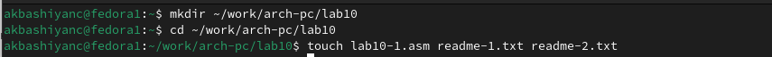{#fig:1_mkdir width=70%}

Скопируем файл in_out.asm из lab06 с помощью mc (рис. [-@fig:2_cp]).

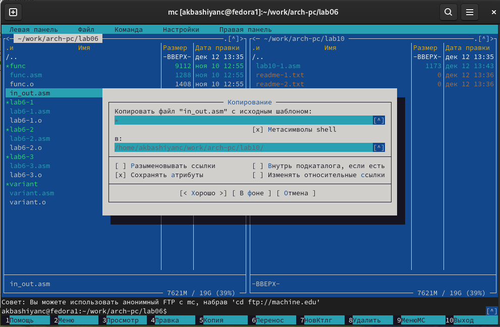{#fig:2_cp width=70%}

Введем код в lab10-1.asm и создадим исполняемый файл и запустим его (рис. [-@fig:3_code] и [-@fig:4_make]).

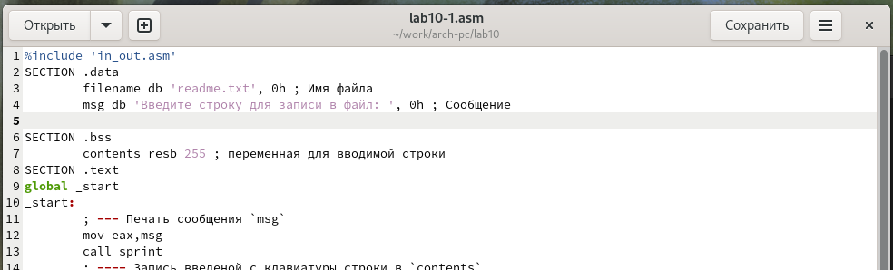{#fig:3_code width=70%}

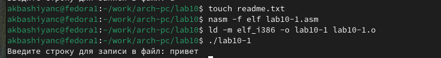{#fig:4_make width=70%}

Проверим, что в файл readme.txt добавилась строка (рис. [-@fig:5_check]).

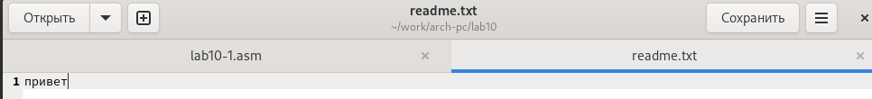{#fig:5_check width=70%}

Изменим права файла lab10-1 и попробуем запустить (рис. [-@fig:6_chmod_work]). Выдало ошибку, так как мы запретили выполнение этого файла.

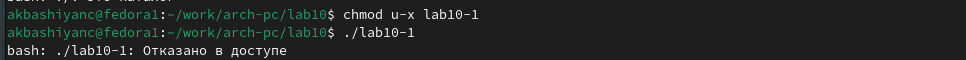{#fig:6_chmod_work width=70%}

Теперь разрешим вполнение файла lab10-1.asm и попробуем запустить (рис. [-@fig:7_chmod_work1]).

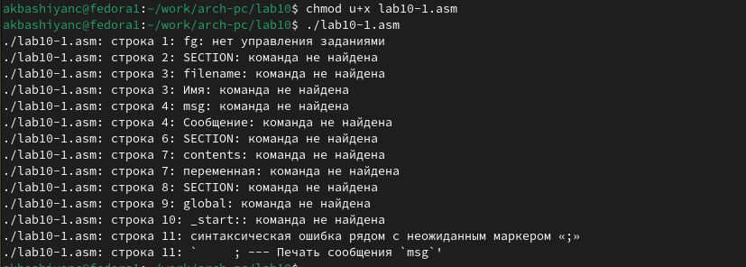{#fig:7_chmod_work1 width=70%}

Изменим права для файлов readme-1.txt и readme-2.txt в соответствии с вариантов(18)(рис. [-@fig:8_chmod1] и [-@fig:9_chmod2]).

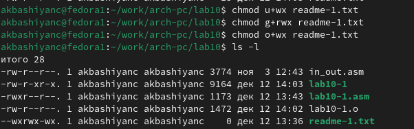{#fig:8_chmod1 width=70%}

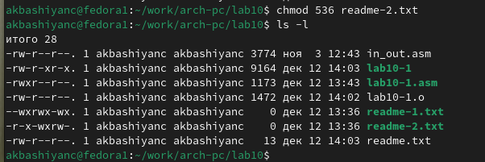{#fig:9_chmod2 width=70%}

## Задание для самостоятельной работы

Создадим файл ex1.asm и введем код по заданию (рис. [-@fig:10_ex1]).

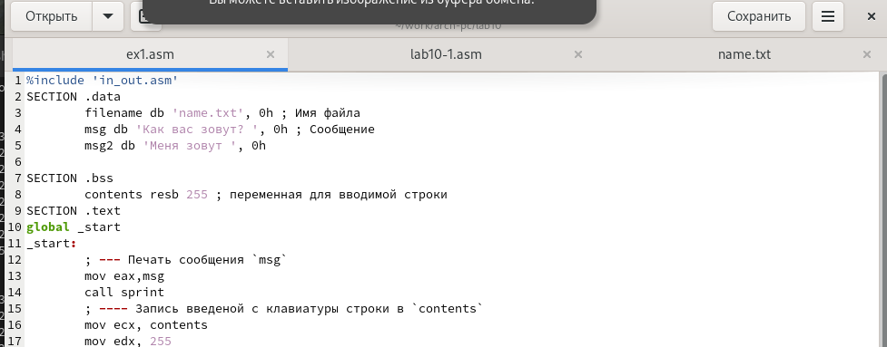{#fig:10_ex1 width=70%}

Создадим исполняемый файл и запустим его (рис. [-@fig:11_work).

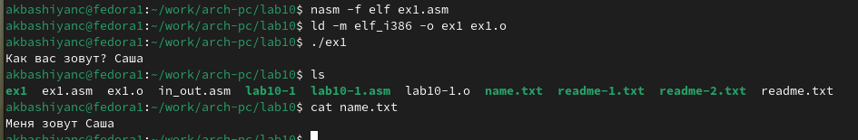{#fig:11_work width=70%}

# Выводы

В ходе выполнения работы были получены навыки работы с файлами в NASM
